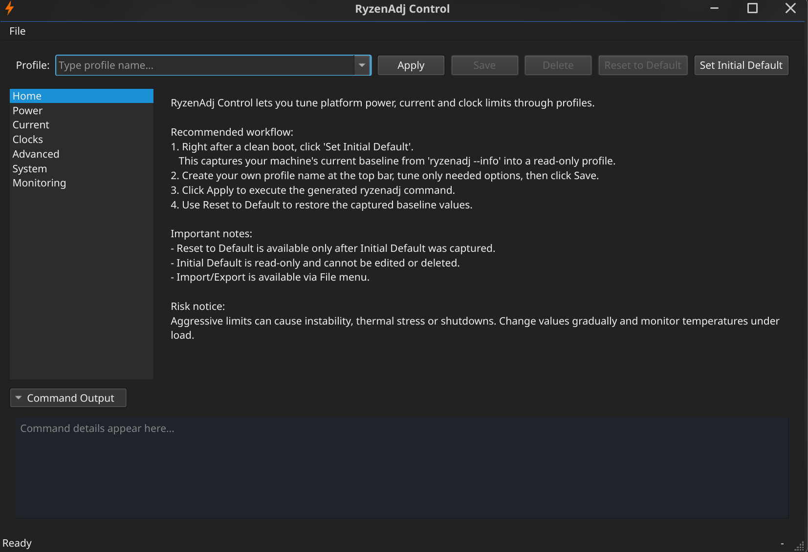
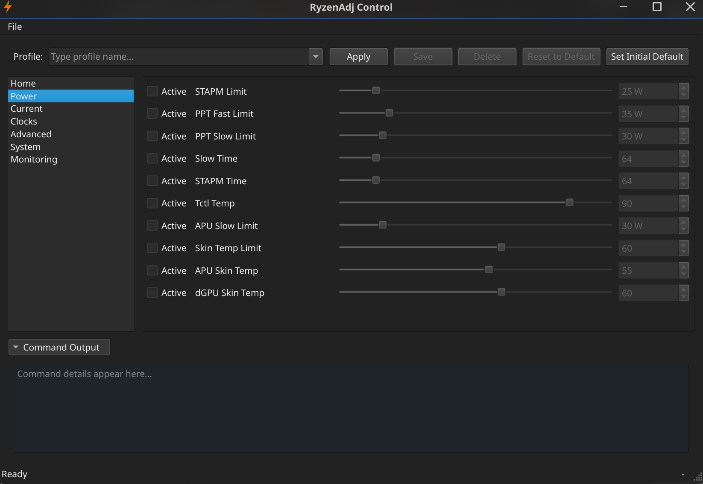
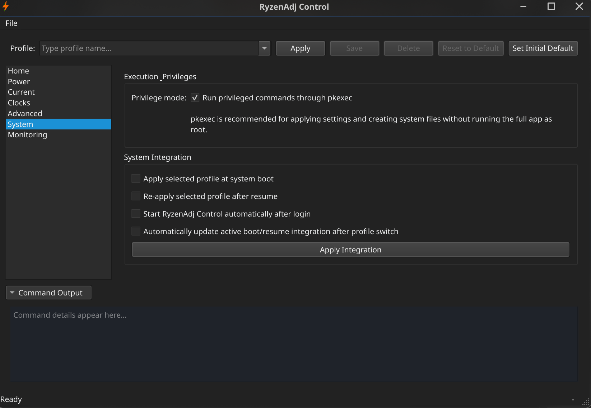

# ryzenadj-gui

Native PyQt6 frontend for `ryzenadj` on Linux.

## Features

- Native Qt6 GUI (PyQt6), lightweight and fast
- Profile management: save, load, delete, reset to captured defaults
- Internal `Initial Default` capture from `ryzenadj --info`
- Full tuning pages for power/current/clocks/advanced options
- Per-setting enable checkbox
- Non-blocking command execution with command output panel
- `pkexec` support for privileged operations
- System integration via checkboxes + `Apply Integration`:
  - apply selected profile at boot
  - re-apply after resume
  - start GUI automatically after login
- Integration state is detected at app startup
- Optional auto-sync of active boot/resume integration after profile switch
- Monitoring page with `ryzenadj --info`

## Screenshots

### Home



### Power



### System Integration



## Dependencies (Required)

Install required runtime dependencies before installation:

**Important:**

- `ryzenadj` must be installed and available in `PATH`.
- `pkexec` must work, otherwise privileged apply/integration actions will fail.

Check `ryzenadj`:

```bash
ryzenadj --version
```

Check `pkexec`:

```bash
pkexec /usr/bin/id
```

## Installation

Package installation instructions will be added once public packages are available.

Planned sections:

- Arch Linux (AUR package)
- Ubuntu/Debian
- Other distributions

## Development

Development dependencies (Arch Linux):

```bash
sudo pacman -S python-pyqt6 ryzenadj polkit
```

Run from source:

```bash
python main.py
```

## Profile Storage

Profiles are saved in:

```text
~/.config/ryzenadj-gui/profiles.json
```

Notes:

- User profiles are visible in the profile selector.
- `Initial Default` is stored internally and hidden from normal profile selection.
- `Reset to Default` is available after `Set Initial Default` was captured.

## Troubleshooting

- `Command not found`: install `ryzenadj` and verify it is in `PATH`.
- Apply does nothing: enable at least one setting before `Apply`.
- Permission errors: enable `pkexec` in System tab.
- Monitoring values show `N/A`: inspect raw `--info` output in Monitoring.
- Some values are reported as unsupported: app may still apply remaining supported values.

## Disclaimer

This application interfaces with `ryzenadj` and allows modifying CPU power, current and related performance parameters.

Altering these values may impact system stability, thermals, performance characteristics and potentially hardware longevity.

This software is provided without warranty.  
Use it at your own risk and ensure you understand the effects of the parameters you modify.

## Development & Testing

This project was developed and tested on:

- Arch Linux  
- AMD Ryzen™ AI Max+ 395  

Core functionality — including applying selected `ryzenadj` parameters — has been verified on this system.

However, only a subset of parameters has been actively tested.  
Behavior may vary depending on hardware, firmware, kernel version and `ryzenadj` support.

If you encounter issues on other Ryzen-based systems, please report them.

## Acknowledgements

This project builds upon the work of the developers behind `ryzenadj` and related Ryzen Linux tooling.

Special thanks to the maintainers of:

- `ryzenadj`

## License

This project is licensed under the MIT License. See `LICENSE`.
